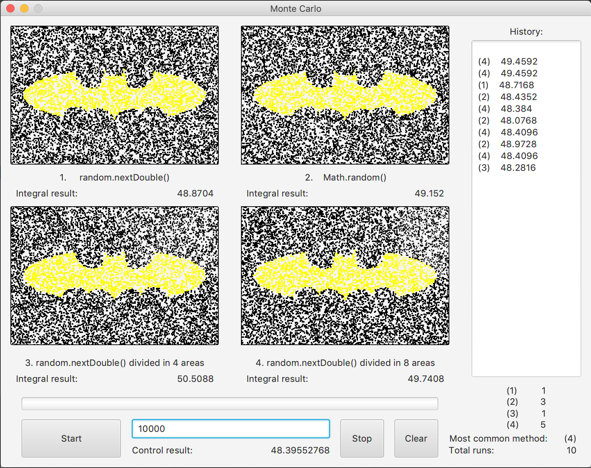

# Numerical Methods Project
Program written in Java to test out different approaches to Monte Carlo method.

App generates reference result using 100000000 pionts in order to get very accurate result. Then it calculates value for n pionts (n provided by the user) using 4 different approaches. After calculating the results, app compares them to the reference result and chooses the closest one as winner. later it adds it to the history list and to counter of the most common winner.

This is the result of the application after performing 10 tests, 10000 points each.
